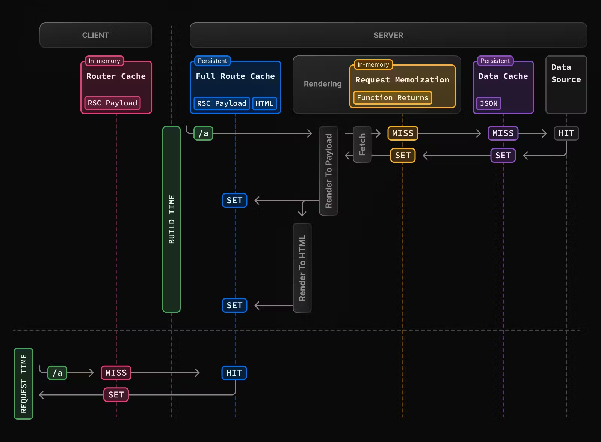

# Next jsda keshning turlari.
Nextda yuqori darajadagi keshlash mexanizimining quydagi turlari mavjud:
Mexanizm

Mechanism	            What	                        Where	                    Purpose	Duration

Request Memoization	    Return values of functions	    Server	                    Re-use data in a React Component tree	Per-request lifecycle

Data Cache	            Data	                        Server	                    Store data across user requests and deployments	Persistent (can be revalidated)

Full Route Cache	    HTML and RSC payload	        Server	                    Reduce rendering cost and improve performance	Persistent (can be revalidated)

Router Cache	        RSC Payload	                    Client	                    Reduce server requests on navigation	User session or time-based

